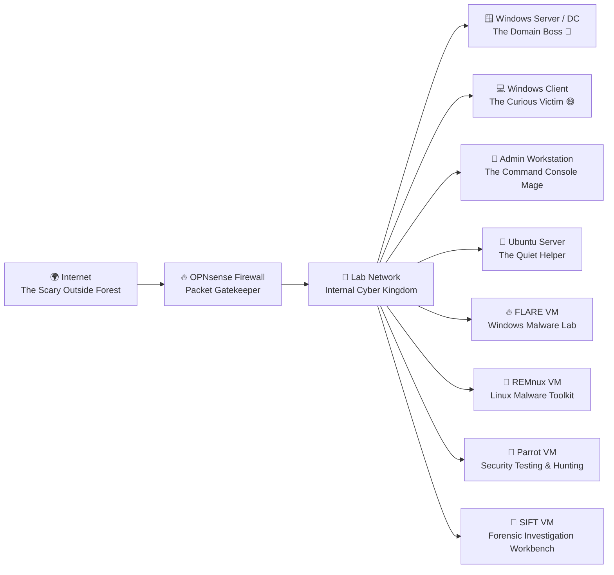
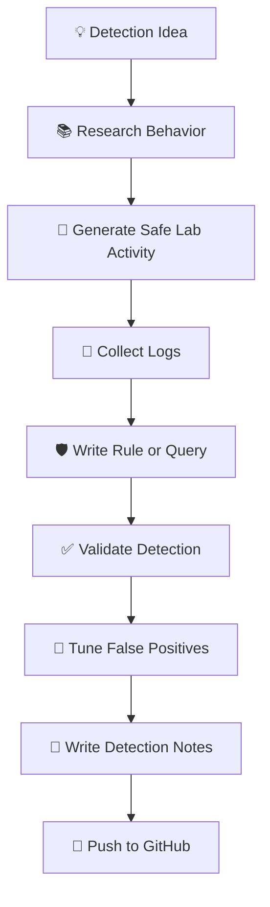

# 🧪 Lab Architecture: Where Logs Are Born and Alerts Learn to Walk ✨🔍

> “In every kingdom, there is chaos. In this lab, we log it, hunt it, and make it write a statement.” 📜

Welcome to my home detection engineering lab: a controlled cyber playground where Windows machines gossip in event logs, Linux boxes sharpen their tools, packets take tiny road trips, and suspicious behavior gets politely turned into detection logic.

This lab is built for one mission:

> **Generate behavior. Collect telemetry. Write detections. Validate. Document. Improve. Repeat.**
> Basically: cyber gym, but the dumbbells are logs. 🏋️‍♂️📊

---

## 🎯 Objective

The objective of this lab is to build a safe, isolated, hands-on environment for practicing:

* Detection engineering
* Threat hunting
* Incident response investigation flow
* Malware analysis basics
* Digital forensics workflows
* Sigma, KQL, YARA, and Suricata rule writing
* Python-assisted security automation
* Detection-as-code using GitHub

This is not just a “VM collection.”
This is a tiny enterprise kingdom where every machine has a job, every log has a story, and every false positive gets side-eyed. 👀

---

## 🏰 High-Level Lab Kingdom

---

## 🧱 Current Lab Components

| Component                             | Platform       | Role                                                                                           | Quirky Nickname          |
| ------------------------------------- | -------------- | ---------------------------------------------------------------------------------------------- | ------------------------ |
| 🔥 OPNsense Firewall                  | OPNsense       | Network firewall, routing, segmentation, and traffic control                                   | The Gatekeeper           |
| 🪟 Windows Server / Domain Controller | Windows Server | Active Directory, DNS, DHCP, users, groups, policies, and domain drama                         | The Domain Boss          |
| 💻 Windows Client                     | Windows 10/11  | Endpoint telemetry, user activity, and controlled test behavior                                | The Curious Victim       |
| 🧙 Admin Workstation                  | Windows 10/11  | Admin simulation, PowerShell testing, remote management, and rule validation                   | The Console Mage         |
| 🐧 Ubuntu Server                      | Ubuntu         | Future log collection, SIEM support, scripting, or service hosting                             | The Quiet Helper         |
| 🔥 FLARE VM                           | Windows        | Malware analysis, reverse engineering, suspicious file triage, and Windows tooling             | The File Whisperer       |
| 🧊 REMnux VM                          | Linux          | Malware analysis toolkit, network artifact analysis, unpacking, and IOC extraction             | The Unpacker             |
| 🦜 Parrot VM                          | Linux          | Security testing, threat hunting utilities, OSINT support, and controlled adversary simulation | The Parrot with Receipts |
| 🔎 SIFT VM                            | Linux          | Digital forensics, disk analysis, timeline analysis, artifact review, and evidence handling    | The Forensic Fox         |
| 📁 GitHub Repository                  | GitHub         | Documentation, rules, writeups, scripts, and detection-as-code practice                        | The Memory Palace        |

---

## 🧠 Why These Machines Exist

Each VM exists for a specific reason. No random cyber furniture here.

### 🔥 OPNsense Firewall

OPNsense is the traffic bouncer. It decides what enters, what leaves, and what gets stared at suspiciously.

Purpose:

* Separate lab traffic from the host/home network
* Route traffic between lab machines
* Control internet access
* Observe firewall and network behavior
* Support future network detection experiments

Detection value:

* Firewall logs
* Connection attempts
* Blocked traffic
* Allowed outbound connections
* Network segmentation testing

---

### 🪟 Windows Server / Domain Controller

The domain controller is the boss castle of the Windows kingdom.

Purpose:

* Active Directory domain services
* User and group management
* Authentication events
* Group policy testing
* Domain-style attack simulation
* Discovery and lateral movement practice

Detection value:

* Logon events
* Account creation
* Group membership changes
* Kerberos and NTLM activity
* Domain discovery traces
* Administrative behavior

This machine is where identity-related detections grow teeth. 🦷

---

### 💻 Windows Client

The Windows client is the regular endpoint where user behavior, suspicious behavior, and “why did that process launch?” moments happen.

Purpose:

* Generate process creation logs
* Test endpoint detections
* Simulate user activity
* Run controlled commands
* Validate Sigma and KQL logic

Detection value:

* Suspicious PowerShell
* Process chains
* Parent-child process relationships
* LOLBin behavior
* File creation
* Network connections
* Persistence attempts

This is where many alerts first learn to crawl. 🐣

---

### 🧙 Admin Workstation

The admin workstation is used to simulate administrative behavior. It helps separate normal admin activity from suspicious admin-looking activity.

Purpose:

* Run admin commands
* Test PowerShell behavior
* Simulate remote management
* Validate detection false positives
* Practice investigation context

Detection value:

* Admin tool usage
* Remote access attempts
* PowerShell remoting
* Suspicious command patterns
* Account and system discovery

This box helps answer the big detection question:

> Is this evil, or is this just admin life wearing steel-toe boots?

---

### 🐧 Ubuntu Server

Ubuntu is the calm little utility box that will eventually host services, scripts, or logging experiments.

Purpose:

* Future log collection
* Python scripts
* Possible SIEM or log pipeline support
* Lightweight service hosting
* Testing Linux-side utilities

Detection value:

* Linux logs
* SSH activity
* File transfer testing
* Scripting automation
* Future ELK, Graylog, Wazuh, or Splunk experiments

Current mood: quiet, useful, slightly mysterious. 🐧

---

## 🔥 FLARE VM: Windows Malware Analysis Lab

FLARE VM is the Windows malware analysis workstation. It is where suspicious files go to be questioned under a bright lamp.

Purpose:

* Static malware analysis
* Windows-based reverse engineering
* PE file inspection
* Suspicious script review
* YARA rule development
* IOC extraction
* Safe file triage

Possible use cases:

* Analyze suspicious executables
* Inspect strings
* Review import tables
* Look for packed binaries
* Study suspicious PowerShell scripts
* Develop YARA rules from file patterns
* Extract indicators from malware-like samples

Detection value:

* File-based detection logic
* YARA rules
* Malware behavior notes
* IOC extraction
* Reverse engineering observations
* Windows artifact understanding

FLARE is not just a VM.
It is the cyber magnifying glass with caffeine. 🔍☕

Safety note:

> Real malware should be handled only in a controlled and isolated environment. No malware samples should be uploaded to GitHub. The repo gets rules, notes, and safe examples only.

---

## 🧊 REMnux VM: Linux Malware Toolkit

REMnux is the Linux malware analysis toolkit. If FLARE is the Windows detective, REMnux is the calm analyst with seventeen tools, a terminal, and terrifying patience.

Purpose:

* Malware analysis support
* Network artifact analysis
* Script analysis
* Unpacking and decoding
* IOC extraction
* Suspicious document/file review
* Command-line investigation

Possible use cases:

* Decode suspicious payloads
* Extract strings and metadata
* Analyze URLs and domains from samples
* Inspect scripts
* Parse artifacts
* Support YARA development
* Analyze malware network behavior in a controlled way

Detection value:

* IOC extraction
* Malware pattern understanding
* File triage
* Suspicious script detection
* Network indicators
* Enrichment workflows

REMnux is where suspicious blobs go from:

> “What is this weird thing?”

to:

> “Here are the indicators, behavior hints, and detection ideas.” 🧊🧠

---

## 🦜 Parrot VM: Security Testing and Threat Hunting Playground

Parrot is the flexible security testing and hunting machine. It is useful for controlled offensive-style testing, OSINT, network checks, and attacker-behavior simulation.

Purpose:

* Security testing
* Threat hunting support
* OSINT workflows
* Network scanning in the lab
* Controlled adversary simulation
* Tool testing
* Detection validation

Possible use cases:

* Generate controlled network activity
* Test scanning detections
* Run discovery commands
* Practice attacker-like workflows safely
* Validate Suricata rules
* Support threat intelligence collection
* Test defensive visibility

Detection value:

* Network scan detection
* Suspicious connection attempts
* Reconnaissance behavior
* Suricata rule validation
* Threat hunting practice
* Lab attack simulation

Parrot is the lab’s noisy bird.
It pokes things, leaves footprints, and then we make detections from the footprints. 🦜👣

---

## 🔎 SIFT VM: Digital Forensics Workbench

SIFT is the forensic investigation workstation. It helps analyze evidence, timelines, disk artifacts, and system activity after something suspicious happens.

Purpose:

* Digital forensics
* Timeline analysis
* Disk image review
* Artifact parsing
* Incident investigation practice
* Evidence-style thinking

Possible use cases:

* Analyze Windows artifacts
* Review timelines
* Inspect file system activity
* Study persistence evidence
* Understand attacker sequence of actions
* Practice post-incident investigation

Detection value:

* Better understanding of forensic artifacts
* Incident timeline creation
* Detection validation after activity
* Evidence-backed writeups
* Root cause analysis practice

SIFT is where the lab puts on glasses and says:

> “Let us reconstruct what actually happened.” 🕵️‍♂️📚

---

## 🛰️ Telemetry Sources

The lab is designed to help me understand different types of telemetry.

| Telemetry Source      | Why It Matters                                                  |
| --------------------- | --------------------------------------------------------------- |
| Windows Security Logs | Logons, account changes, privilege use, authentication behavior |
| Windows System Logs   | Service activity, system-level events, operational clues        |
| PowerShell Logs       | Script execution, encoded commands, suspicious automation       |
| Sysmon Logs           | Process, network, registry, file, and image load visibility     |
| DNS Logs              | Domain lookups and potential command-and-control clues          |
| Firewall Logs         | Allowed and blocked traffic                                     |
| Suricata Alerts       | Network detection and IDS logic                                 |
| YARA Scan Results     | File-pattern detection and malware signature logic              |
| Forensic Artifacts    | Timeline and post-incident reconstruction                       |
| Python Output         | IOC extraction, parsing, field profiling, and automation        |

---

## 🔄 Detection Engineering Workflow

The workflow is simple:

> Do the thing.
> Log the thing.
> Detect the thing.
> Explain the thing.
> Improve the thing.

Very scientific. Slightly suspicious. Highly useful. 🧪

---

## 🎯 Current Detection Goals

### 1. Suspicious PowerShell Activity ⚡

Focus:

* Encoded commands
* Suspicious download strings
* PowerShell launched by unusual parent processes
* Obfuscation patterns
* Script execution from strange paths

Detection outputs:

* Sigma rule
* KQL query
* Detection writeup
* Validation notes

---

### 2. Windows Discovery Behavior 🕵️

Focus:

* User discovery
* Group discovery
* Domain discovery
* Network share discovery
* System information gathering

Example behaviors:

* `whoami`
* `net user`
* `net group`
* `nltest`
* `ipconfig`
* `systeminfo`
* `net view`

Detection goal:

> Find when normal commands start moving together like a suspicious marching band. 🥁

---

### 3. Suspicious Account Creation 👤

Focus:

* New local user creation
* Local administrator group changes
* Suspicious privilege assignment
* Account creation followed by remote access

Detection goal:

> Catch “new user who dis?” moments before they become incident reports.

---

### 4. Lateral Movement Clues 🚪

Focus:

* Remote logons
* Admin share access
* Remote service creation
* Remote command execution
* Unusual source-to-destination authentication

Detection goal:

> Understand how movement across machines appears in logs, then turn that into useful alert logic.

---

### 5. Pre-Ransomware Behavior 🧨

Focus:

* Discovery bursts
* Backup server access
* Shadow copy deletion attempts
* Archive creation
* Mass file access
* Remote tool usage
* Defense weakening behavior

Detection goal:

> Alert before encryption begins, because after encryption the incident has already put on tap shoes and entered the finance department.

---

### 6. Malware File Pattern Detection 🧬

Focus:

* Suspicious strings
* Obfuscation markers
* Packed binary hints
* Common malware-like script patterns
* File metadata clues
* YARA rule development

Main VMs:

* FLARE VM
* REMnux VM

Detection outputs:

* YARA rules
* IOC notes
* Malware analysis summaries
* Safe sample descriptions
* Rule validation notes

---

### 7. Forensic Investigation Practice 🔎

Focus:

* Timeline creation
* Windows artifacts
* Disk and file-system review
* Persistence clues
* Post-incident reconstruction

Main VM:

* SIFT VM

Detection value:

> Better forensic thinking creates better detections. If I understand the artifact trail, I can write sharper logic.

---

### 8. Network Detection Practice 🌐

Focus:

* Suspicious outbound traffic
* Scanning behavior
* Strange user agents
* DNS oddities
* Suricata rule development

Main VMs:

* OPNsense
* Parrot
* Ubuntu
* REMnux

Detection outputs:

* Suricata rules
* Network investigation notes
* Alert validation notes
* PCAP-based research notes

---

## 🧰 Tooling Map

| Tool / Platform | Main Use                                                |
| --------------- | ------------------------------------------------------- |
| Sigma           | Platform-agnostic detection logic                       |
| KQL             | Microsoft Sentinel / Defender hunting queries           |
| YARA            | File and malware-pattern detection                      |
| Suricata        | Network IDS detection                                   |
| Python          | IOC extraction, parsing, validation helpers, automation |
| FLARE VM        | Windows malware analysis and reverse engineering        |
| REMnux          | Linux malware analysis, decoding, IOC extraction        |
| Parrot          | Security testing, threat hunting, controlled simulation |
| SIFT            | Digital forensics and incident reconstruction           |
| OPNsense        | Firewalling, segmentation, network visibility           |
| GitHub          | Version control, documentation, portfolio               |
| GitHub Actions  | Future detection-as-code validation                     |

---

## 📁 Repository Mapping

| Repository Folder    | Purpose                                                         |
| -------------------- | --------------------------------------------------------------- |
| `docs/`              | Lab architecture, learning notes, references, and documentation |
| `sigma/`             | Sigma rules for behavior-based detection                        |
| `kql/`               | KQL hunting queries for Microsoft telemetry                     |
| `yara/`              | YARA rules for suspicious files and malware-like patterns       |
| `suricata/`          | Suricata IDS rules for network detection                        |
| `python/`            | Security automation scripts and detection helpers               |
| `reports/`           | Detection writeups, research notes, and validation summaries    |
| `tests/`             | Safe test data, sample logs, and validation notes               |
| `.github/workflows/` | Future CI/CD validation workflows                               |

---

## 🧪 Example Rule Development Cycle

For every serious detection, I want to follow this pattern:

1. **Pick a behavior**

   * Example: PowerShell encoded command execution

2. **Research the technique**

   * Understand why attackers use it
   * Understand where it appears in telemetry

3. **Generate safe lab activity**

   * Run controlled commands
   * Avoid real-world harm
   * Keep experiments isolated

4. **Collect logs**

   * Windows Event Logs
   * Sysmon
   * PowerShell logs
   * Firewall or IDS logs if relevant

5. **Write detection logic**

   * Sigma for generic behavior
   * KQL for hunting
   * YARA for file patterns
   * Suricata for network behavior

6. **Validate**

   * Confirm the rule detects the behavior
   * Confirm the correct fields are captured
   * Confirm expected alert details

7. **Tune**

   * Reduce noise
   * Add conditions
   * Improve field selection
   * Note false positives

8. **Document**

   * What it detects
   * Why it matters
   * Required telemetry
   * False positives
   * Investigation steps
   * MITRE ATT&CK mapping

9. **Publish**

   * Push rule, query, and writeup to GitHub

This is how a detection idea grows from a tiny cyber seed into a respectable alert tree. 🌱🚨

---

## 🧯 Lab Safety Rules

| Rule                         | Reason                                             |
| ---------------------------- | -------------------------------------------------- |
| No real malware in GitHub    | Public repos are not malware aquariums             |
| No company/client data       | Work data stays at work                            |
| No credentials or secrets    | Tokens do not belong in public like lost pigeons   |
| No production logs           | Only lab-generated or sanitized data               |
| Use snapshots often          | Rollback is cheaper than sadness                   |
| Keep risky analysis isolated | Malware analysis needs boundaries                  |
| Document what was tested     | Future me should not have to solve ancient riddles |

Golden rule:

> If it can cause real-world damage, it does not belong in the public repo.

---

## 📸 Snapshot Strategy

Snapshots are taken before and after major changes.

| VM                  | Snapshot Example                    | Purpose                           |
| ------------------- | ----------------------------------- | --------------------------------- |
| OPNsense            | `opnsense-working-network-baseline` | Stable firewall and routing setup |
| Windows Server / DC | `dc01-domain-baseline`              | Clean AD rollback point           |
| Windows Client      | `winclient-domain-joined`           | Endpoint testing baseline         |
| Admin Workstation   | `admin01-before-tests`              | Safe rollback before experiments  |
| Ubuntu Server       | `ubuntu-before-log-stack`           | Before installing log tools       |
| FLARE VM            | `flare-clean-analysis-baseline`     | Before suspicious file analysis   |
| REMnux VM           | `remnux-clean-toolkit-baseline`     | Before malware/tool experiments   |
| Parrot VM           | `parrot-clean-testing-baseline`     | Before security testing activity  |
| SIFT VM             | `sift-clean-forensics-baseline`     | Before forensic case work         |

Tiny commandment:

> Snapshot before chaos. Restore after chaos. Document during chaos. ☕📸

---

## 🧾 What Good Documentation Should Capture

Each detection or lab experiment should record:

| Question                        | Documentation Needed                         |
| ------------------------------- | -------------------------------------------- |
| What was tested?                | Clear behavior summary                       |
| Why does it matter?             | Security relevance                           |
| Which machine was used?         | Source VM and target VM                      |
| What logs were generated?       | Event IDs, log source, table, or tool output |
| What rule/query was written?    | Sigma, KQL, YARA, or Suricata                |
| Did it work?                    | Validation result                            |
| What could be noisy?            | False positive notes                         |
| What should an analyst do next? | Investigation guidance                       |
| What did I learn?               | Key takeaway                                 |

A good detection writeup should not just say:

> “Alert fired.”

It should say:

> “Here is what happened, here is why it matters, here is how I found it, here is how I tested it, and here is how I would investigate it.”

That is the good stuff. The crunchy center. 🥨

---

## 🧑‍💻 Planned Lab Growth

### Phase 1: Foundation 🧱

* Build network
* Configure OPNsense
* Set up domain controller
* Join Windows systems to the domain
* Create GitHub repository
* Document architecture

### Phase 2: Telemetry 📡

* Enable useful Windows logging
* Add Sysmon
* Collect PowerShell logs
* Review authentication logs
* Understand firewall visibility
* Document important fields

### Phase 3: Detection Rules 🛡️

* Write first Sigma rules
* Write first KQL queries
* Add YARA rules
* Add Suricata rules
* Create detection writeups

### Phase 4: Malware and File Analysis 🧬

* Use FLARE for Windows-based analysis
* Use REMnux for Linux-based analysis
* Extract IOCs
* Write YARA rules
* Document safe analysis workflow

### Phase 5: Forensics and Incident Reconstruction 🔎

* Use SIFT for forensic analysis
* Build timelines
* Review artifacts
* Connect evidence to detection logic
* Improve investigation notes

### Phase 6: Detection-as-Code ⚙️

* Add GitHub Actions
* Validate YAML syntax
* Validate Sigma rules
* Validate YARA rules
* Add automated checks
* Build repeatable detection workflow

### Phase 7: Threat Research Mode 🕵️

* Read public reports
* Extract behaviors
* Map behaviors to ATT&CK
* Build lab simulations
* Write detections
* Publish structured writeups

---

## 🧠 Final Mission Statement

This lab exists to help me become stronger at turning suspicious behavior into tested, explainable detections.

Every machine has a purpose.

Every log has a clue.

Every detection should answer:

> **What happened, why does it matter, how can I see it, and how can I prove it?**

That is the mission.

The lab is the map.
The logs are the breadcrumbs.
The rules are the traps.
The writeups are the spellbook. 📘✨

And somewhere in the middle, a tiny alert owl screams:

> “Something happened!” 🦉🚨

