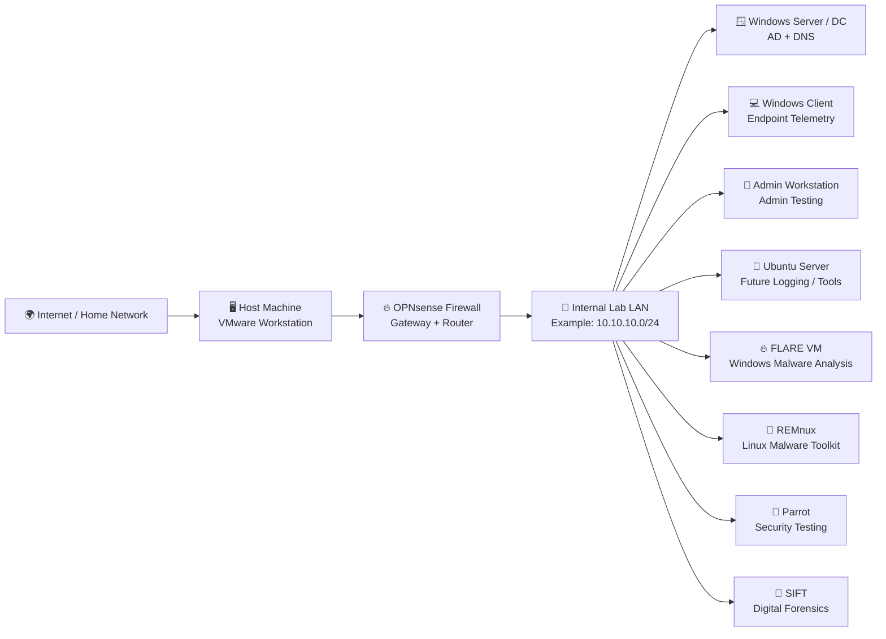

# 🌐 Phase 01: Network Setup

> “If the network is wrong, everything else becomes a ghost story with IP addresses.” 👻📡

This file documents the network setup for my home detection engineering lab.

The goal of this network is to create a safe, isolated environment where lab machines can communicate, generate telemetry, join the domain, access controlled internet resources when needed, and support future detection engineering workflows.

This network is the road system of the lab kingdom.

OPNsense is the gatekeeper.
The domain controller is the town hall.
The clients are citizens.
The analysis VMs are the suspiciously well-equipped researchers in the basement. 🧪

---

## 🎯 Objective

The objective of this network setup is to support:

* Active Directory lab communication
* Windows endpoint telemetry generation
* Admin workstation activity
* Controlled internet access
* Firewall visibility
* Future log collection
* Future SIEM integration
* Suricata network detection
* Malware analysis isolation planning
* Threat hunting and detection validation

The lab network should be:

* Stable
* Predictable
* Isolated from production/work networks
* Easy to document
* Easy to troubleshoot
* Safe enough for controlled security testing
* Flexible enough for future detection projects

Tiny network law:

> If I cannot explain the network, I cannot trust the alerts coming from it. 🧠

---

## 🏰 High-Level Network Design

```text
Internet / Home Network
        |
        v
Host Machine / VMware
        |
        v
OPNsense Firewall
        |
        v
Internal Lab Network
        |
        +-- Windows Server / Domain Controller
        +-- Windows Client
        +-- Admin Workstation
        +-- Ubuntu Server
        +-- FLARE VM
        +-- REMnux VM
        +-- Parrot VM
        +-- SIFT VM
```

The design uses OPNsense as the main firewall and router between the outside network and the internal lab network.

This helps keep the lab organized and gives one clear place to observe, control, and troubleshoot network traffic.

---

## 🧭 Logical Network Diagram



Note:

> The subnet shown here is an example. Actual lab IPs should be documented below and updated as the lab evolves.

---

## 🧱 Network Zones

| Zone                | Purpose                                   | Notes                                                               |
| ------------------- | ----------------------------------------- | ------------------------------------------------------------------- |
| WAN / External      | Allows controlled internet access         | Used for updates, downloads, and external connectivity when needed  |
| LAB LAN             | Internal lab network                      | Main isolated network for Windows, Linux, analysis, and testing VMs |
| Domain Services     | AD, DNS, authentication                   | Provided by Windows Server / Domain Controller                      |
| Analysis Systems    | Malware analysis and forensic tools       | FLARE, REMnux, SIFT                                                 |
| Testing Systems     | Controlled testing and traffic generation | Parrot, Windows Client, Admin Workstation                           |
| Future Logging Zone | SIEM or log collector                     | Ubuntu may support this later                                       |

Network philosophy:

> Keep the kingdom small, named, mapped, and slightly suspicious of all packets. 🏰

---

## 🔢 IP Address Plan

Use this table to document the actual lab IPs.

Example subnet used for documentation:

```text
10.10.10.0/24
```

Update this table with real values from the lab.

| System              | Role                     |    IP Address | Assignment        |     DNS Server |       Gateway | Status   |
| ------------------- | ------------------------ | ------------: | ----------------- | -------------: | ------------: | -------- |
| OPNsense LAN        | Lab gateway              |  `10.10.10.1` | Static            |            N/A |           N/A | ⏳ Update |
| Windows Server / DC | AD + DNS                 | `10.10.10.10` | Static            |  `10.10.10.10` |  `10.10.10.1` | ⏳ Update |
| Windows Client      | Endpoint                 | `10.10.10.20` | DHCP / Static     |  `10.10.10.10` |  `10.10.10.1` | ⏳ Update |
| Admin Workstation   | Admin testing            | `10.10.10.30` | DHCP / Static     |  `10.10.10.10` |  `10.10.10.1` | ⏳ Update |
| Ubuntu Server       | Utility / future logging | `10.10.10.40` | Static / DHCP     |  `10.10.10.10` |  `10.10.10.1` | ⏳ Update |
| FLARE VM            | Malware analysis         | `10.10.10.50` | Static / Isolated | Lab DNS / None | Lab GW / None | ⏳ Update |
| REMnux VM           | Malware analysis         | `10.10.10.60` | Static / Isolated | Lab DNS / None | Lab GW / None | ⏳ Update |
| Parrot VM           | Security testing         | `10.10.10.70` | Static / DHCP     |  `10.10.10.10` |  `10.10.10.1` | ⏳ Update |
| SIFT VM             | Forensics                | `10.10.10.80` | Static / DHCP     |  `10.10.10.10` |  `10.10.10.1` | ⏳ Update |

Important:

* Critical infrastructure should use static IPs.
* Domain Controller should have a predictable IP.
* Clients can use DHCP if DHCP is stable.
* Malware analysis VMs may need stricter isolation depending on the task.

Tiny rule:

> Static IPs are not glamorous, but neither is troubleshooting DNS at midnight. 🌙

---

## 🔥 OPNsense Network Role

OPNsense is the central firewall and router for the lab.

Its responsibilities:

* Provide gateway for lab machines
* Route traffic between lab and outside network
* Control outbound access
* Provide DHCP if configured
* Provide firewall logs
* Support segmentation later
* Act as the boundary between lab and non-lab networks

OPNsense is the packet customs officer.

Every packet gets a tiny passport check. 🛂

---

## 🔌 OPNsense Interfaces

Document actual interface details here.

| Interface | Purpose              | Example Network   | Notes                                |
| --------- | -------------------- | ----------------- | ------------------------------------ |
| WAN       | Outside access       | Home/host network | Used for internet access and updates |
| LAN       | Internal lab network | `10.10.10.0/24`   | Main lab network for VMs             |

Example:

```text
WAN: Connected to host/home network
LAN: Connected to internal lab VM network
```

Update this once confirmed:

```text
WAN Interface:
LAN Interface:
LAN IP:
DHCP Enabled:
DNS Forwarding:
Firewall Rules:
```

---

## 🧾 DHCP Plan

Decide whether OPNsense or the Domain Controller handles DHCP.

Recommended beginner approach:

| Option              | Pros                              | Cons                                    |
| ------------------- | --------------------------------- | --------------------------------------- |
| OPNsense DHCP       | Simple, centralized with firewall | AD-focused DHCP features not used       |
| Windows Server DHCP | More enterprise-like              | Slightly more setup and troubleshooting |
| Static IPs only     | Predictable                       | Manual work and easy to misconfigure    |

Current plan:

```text
Critical systems: Static IP
Clients/testing systems: DHCP or reserved IP
```

Suggested DHCP range:

```text
10.10.10.100 - 10.10.10.200
```

Reserved/static range:

```text
10.10.10.1 - 10.10.10.99
```

Example design:

| Range                         | Purpose                                  |
| ----------------------------- | ---------------------------------------- |
| `10.10.10.1`                  | Gateway / OPNsense                       |
| `10.10.10.10 - 10.10.10.99`   | Servers, analysis VMs, important systems |
| `10.10.10.100 - 10.10.10.200` | DHCP clients                             |
| `10.10.10.201 - 10.10.10.254` | Reserved for future use                  |

Tiny DHCP truth:

> DHCP is wonderful until it gives your machine a new identity during troubleshooting. Then it becomes a shapeshifter. 🦎

---

## 🧭 DNS Plan

For domain-joined Windows machines, DNS is critical.

Recommended setup:

| System Type       | DNS Server                                          |
| ----------------- | --------------------------------------------------- |
| Domain Controller | Itself or configured forwarders                     |
| Windows Client    | Domain Controller IP                                |
| Admin Workstation | Domain Controller IP                                |
| Ubuntu Server     | Domain Controller IP or OPNsense, depending on role |
| FLARE VM          | Depends on isolation mode                           |
| REMnux VM         | Depends on isolation mode                           |
| Parrot VM         | Depends on testing purpose                          |
| SIFT VM           | Depends on investigation purpose                    |

Important Active Directory rule:

> Domain-joined Windows systems should use the Domain Controller as DNS.

Example:

```text
Preferred DNS for Windows domain clients: 10.10.10.10
Gateway: 10.10.10.1
```

Why:

* Domain join depends on DNS
* DC discovery depends on DNS
* Group Policy depends on DNS
* Authentication can break if DNS is wrong
* The lab becomes haunted if clients use random external DNS

DNS is not optional in AD.

DNS is the kingdom’s address book. 📖

---

## 🪟 Domain Controller Network Settings

The Domain Controller should use a static IP.

Example:

```text
IP Address: 10.10.10.10
Subnet Mask: 255.255.255.0
Gateway: 10.10.10.1
Preferred DNS: 10.10.10.10
Alternate DNS: Leave blank or use carefully
```

Checklist:

* [ ] Static IP assigned
* [ ] DNS role installed
* [ ] AD DS installed
* [ ] Domain created
* [ ] DNS zone working
* [ ] Client can resolve domain
* [ ] Client can join domain
* [ ] Snapshot taken after stable setup

Domain Controller rule:

> Do not let the DC wander around with random DHCP identity energy. Give it a stable address and a calm life. 🧘

---

## 💻 Windows Client Network Settings

The Windows Client should be able to:

* Reach the Domain Controller
* Resolve the domain name
* Join the domain
* Reach the gateway
* Access internet if allowed
* Generate endpoint telemetry later

Example settings:

```text
IP Address: DHCP or static
DNS Server: Domain Controller IP
Gateway: OPNsense LAN IP
```

Checks:

```powershell
ipconfig /all
ping <dc-ip>
nslookup <domain-name>
nltest /dsgetdc:<domain-name>
whoami /fqdn
```

Expected result:

* Client receives proper IP
* DNS points to DC
* Domain lookup works
* Domain join succeeds
* OPNsense shows DHCP lease if DHCP is enabled

---

## 🧙 Admin Workstation Network Settings

The Admin Workstation should mirror a realistic admin system.

It should be able to:

* Reach the DC
* Join the domain
* Use domain DNS
* Run admin tools
* Generate PowerShell/admin telemetry
* Support future detection validation

Example checks:

```powershell
ipconfig /all
ping <dc-ip>
nslookup <domain-name>
whoami /groups
nltest /dsgetdc:<domain-name>
```

Detection use later:

* Admin commands
* Remote management
* PowerShell activity
* Account management
* False-positive testing

Admin workstation thought:

> Not every powerful command is evil. Some are just admin life with a clipboard. 📋

---

## 🐧 Ubuntu Server Network Settings

Ubuntu may support future services such as:

* Log collection
* Syslog
* SIEM components
* Python scripts
* Web server for safe testing
* File transfer testing
* Automation support

Example checks:

```bash
ip addr
ip route
ping <gateway-ip>
ping <dc-ip>
nslookup <domain-name>
```

Possible future roles:

| Future Role            | Network Need                                   |
| ---------------------- | ---------------------------------------------- |
| Syslog server          | Lab systems must reach Ubuntu                  |
| Web server             | Lab clients can generate HTTP logs             |
| Log collector          | Needs stable IP                                |
| SIEM support           | Needs enough resources and predictable address |
| Python automation host | Needs access to test data and lab logs         |

Ubuntu is the utility drawer.

Not flashy.

Always useful when something needs doing. 🐧

---

## 🔥 FLARE VM Network Notes

FLARE VM is for Windows malware analysis and suspicious file review.

Network mode should depend on activity.

Recommended modes:

| Mode                 | Use Case                                   |
| -------------------- | ------------------------------------------ |
| Isolated / Host-only | Safer malware analysis practice            |
| Lab LAN only         | Controlled analysis with internal services |
| Internet disabled    | Default for suspicious file execution      |
| Controlled internet  | Only when safe and necessary               |

Important:

* Do not run real malware with unrestricted internet.
* Do not upload malware samples to GitHub.
* Use snapshots before analysis.
* Consider no shared folders during risky work.
* Use REMnux as controlled support system when needed.

FLARE network rule:

> Files can be suspicious. Networks can be messy. Keep both on a leash. 🦮

---

## 🧊 REMnux Network Notes

REMnux supports malware analysis, IOC extraction, decoding, and network artifact review.

Possible network roles:

* Controlled analysis support
* Fake service hosting later
* Network artifact review
* DNS/HTTP simulation later
* IOC extraction and decoding

Recommended network posture:

| Mode                | Use Case                      |
| ------------------- | ----------------------------- |
| Lab LAN             | General analysis support      |
| Isolated with FLARE | Controlled malware workflow   |
| Internet controlled | Updates or safe research only |

Future use:

* Analyze suspicious traffic
* Extract indicators
* Support YARA development
* Review PCAPs
* Support network simulation

REMnux is the calm terminal wizard.

It does not panic.

It parses. 🧊

---

## 🦜 Parrot Network Notes

Parrot is used for controlled security testing and threat hunting practice.

Allowed lab uses:

* Internal scanning
* Network testing
* Safe traffic generation
* Suricata rule validation
* Recon behavior simulation
* Threat hunting workflow support

Do not use Parrot for:

* Scanning public targets without permission
* Running tools against non-lab systems
* Generating uncontrolled traffic
* Anything outside the lab boundary

Parrot rule:

> Parrot only pokes the lab. The outside world is not a training dummy. 🦜

Example checks:

```bash
ip addr
ip route
ping <gateway-ip>
ping <target-lab-ip>
nmap -sn <lab-subnet>
```

Use scanning only inside the lab.

---

## 🔎 SIFT Network Notes

SIFT is used for digital forensics and investigation work.

Network needs may be limited.

Possible network uses:

* Pulling lab evidence
* Accessing shared forensic data
* Updating tools
* Reviewing logs
* Supporting incident reconstruction

Recommended posture:

| Mode                | Use Case                      |
| ------------------- | ----------------------------- |
| Lab LAN             | Access lab evidence and logs  |
| Controlled internet | Updates only                  |
| Isolated            | For sensitive artifact review |

SIFT is more about evidence than traffic generation.

It is the lab’s forensic librarian with a magnifying glass. 🔎

---

## 🧪 Connectivity Test Plan

Use this table to track basic connectivity.

| Test                        | Source            | Destination     | Command                       | Expected Result     | Status |
| --------------------------- | ----------------- | --------------- | ----------------------------- | ------------------- | ------ |
| Gateway reachability        | Windows Client    | OPNsense LAN IP | `ping <gateway-ip>`           | Reply received      | ⏳      |
| DC reachability             | Windows Client    | DC IP           | `ping <dc-ip>`                | Reply received      | ⏳      |
| DNS lookup                  | Windows Client    | Domain name     | `nslookup <domain-name>`      | DC resolves domain  | ⏳      |
| Domain controller discovery | Windows Client    | Domain          | `nltest /dsgetdc:<domain>`    | DC returned         | ⏳      |
| Internet access             | Windows Client    | Public site     | Browser / ping / update check | Works if allowed    | ⏳      |
| OPNsense DHCP lease         | OPNsense          | Client          | DHCP lease page               | Client visible      | ⏳      |
| Admin to DC                 | Admin Workstation | DC              | `ping <dc-ip>`                | Reply received      | ⏳      |
| Ubuntu to gateway           | Ubuntu            | OPNsense LAN IP | `ping <gateway-ip>`           | Reply received      | ⏳      |
| Parrot to lab               | Parrot            | Lab subnet      | `ping` / controlled scan      | Lab-only visibility | ⏳      |

---

## 🧰 Useful Commands

### Windows

```powershell
ipconfig /all
ping <gateway-ip>
ping <domain-controller-ip>
nslookup <domain-name>
nltest /dsgetdc:<domain-name>
whoami /fqdn
whoami /groups
route print
Test-NetConnection <target-ip> -Port <port>
```

### Linux

```bash
ip addr
ip route
cat /etc/resolv.conf
ping <gateway-ip>
ping <domain-controller-ip>
nslookup <domain-name>
dig <domain-name>
traceroute <target-ip>
```

### OPNsense Checks

```text
Interfaces
Firewall rules
DHCP leases
DNS settings
Gateway status
Firewall logs
System logs
```

---

## 🛡️ Firewall Rule Philosophy

Initial firewall rules should be simple and understandable.

Beginner-friendly approach:

| Rule Type                 | Purpose                                        |
| ------------------------- | ---------------------------------------------- |
| Allow LAB LAN to gateway  | Basic routing                                  |
| Allow LAB LAN to DNS      | Domain and name resolution                     |
| Allow LAB LAN to internet | Updates and controlled downloads, if needed    |
| Block unwanted inbound    | Keep lab protected                             |
| Log selected traffic      | Support troubleshooting and detection learning |

Do not create random rules without notes.

Firewall rules without documentation become ancient cave paintings with ports. 🪨

For each firewall rule, document:

| Field         | Notes                |
| ------------- | -------------------- |
| Rule Name     | Clear purpose        |
| Source        | Which system/network |
| Destination   | Which system/network |
| Port/Protocol | What traffic         |
| Action        | Allow or block       |
| Logging       | Enabled or disabled  |
| Reason        | Why the rule exists  |

---

## 🔍 Network Detection Relevance

This network setup supports future detection work.

| Future Detection Area        | Network Requirement                       |
| ---------------------------- | ----------------------------------------- |
| Suspicious outbound traffic  | OPNsense / Suricata visibility            |
| DNS-based detection          | DNS logs and queries                      |
| PowerShell download activity | Endpoint + network correlation            |
| Reconnaissance detection     | Parrot traffic inside lab                 |
| Lateral movement             | Windows systems communicating internally  |
| Malware analysis             | FLARE and REMnux controlled network modes |
| Forensic reconstruction      | SIFT access to logs and artifacts         |
| SIEM pipeline                | Ubuntu or future log server               |

Important idea:

> Network alerts are stronger when connected to endpoint logs.

Example:

```text
Suricata alert: Suspicious User-Agent
        ↓
Check source IP
        ↓
Map to hostname
        ↓
Review Windows process logs
        ↓
Find PowerShell command line
        ↓
Write Sigma + KQL detection
```

That is how packet whispers become detection stories. 📖

---

## 📸 Snapshot Points for Network Setup

Take snapshots after stable network milestones.

| Snapshot Name                     | When to Take                          | Purpose                  |
| --------------------------------- | ------------------------------------- | ------------------------ |
| `opnsense-network-baseline`       | After LAN/WAN works                   | Stable firewall rollback |
| `dc01-static-ip-dns-ready`        | After DC IP and DNS stable            | AD foundation rollback   |
| `winclient-network-ready`         | After client receives correct IP/DNS  | Endpoint baseline        |
| `admin01-network-ready`           | After admin workstation network works | Admin baseline           |
| `ubuntu-network-ready`            | After Ubuntu network configured       | Utility baseline         |
| `flare-network-isolated-baseline` | Before suspicious analysis            | Malware analysis safety  |
| `remnux-network-ready`            | After REMnux network checks           | Analysis support         |
| `parrot-lab-only-baseline`        | Before testing/scanning               | Safe testing rollback    |
| `sift-network-ready`              | After SIFT access configured          | Forensic baseline        |

Snapshot thought:

> A snapshot is a save point before the boss fight. 🎮

---

## 🧯 Common Issues and Fix Notes

Use this section to document actual problems.

### Issue: Client Cannot Join Domain

Possible causes:

* Wrong DNS server
* DC unreachable
* Time mismatch
* Firewall blocking traffic
* Domain name typed incorrectly

Checks:

```powershell
ipconfig /all
ping <dc-ip>
nslookup <domain-name>
nltest /dsgetdc:<domain-name>
```

Lesson:

> In Active Directory labs, always suspect DNS first. Then suspect DNS again. Then maybe check something else. 🧭

---

### Issue: No Internet Access

Possible causes:

* OPNsense WAN issue
* Wrong gateway
* Firewall rule missing
* DNS forwarding issue
* NAT issue

Checks:

```powershell
ping <gateway-ip>
ping 8.8.8.8
nslookup example.com
```

OPNsense checks:

```text
WAN status
Gateway status
Firewall rules
NAT rules
DNS settings
```

---

### Issue: DHCP Lease Not Showing

Possible causes:

* VM connected to wrong network adapter
* DHCP disabled
* Wrong interface selected
* Static IP configured on client
* Client not renewing lease

Checks:

```powershell
ipconfig /release
ipconfig /renew
ipconfig /all
```

OPNsense checks:

```text
Services → DHCPv4 → Leases
Interfaces → LAN
Firewall logs
```

---

### Issue: Wrong DNS Server on Client

Possible causes:

* DHCP option misconfigured
* Static DNS set incorrectly
* Client using external DNS
* Adapter settings not updated

Fix:

* Set DNS to Domain Controller IP
* Renew DHCP lease
* Verify with `ipconfig /all`
* Test domain resolution

---

## 🔐 Public Documentation Safety

This file is safe for public GitHub because it avoids sensitive real-world data.

Do not include:

* Work network details
* Company IP ranges
* Client hostnames
* Credentials
* Screenshots showing sensitive data
* Real incident infrastructure
* Private VPN details
* Personal public IPs
* Unblurred tokens or keys

Allowed:

* Lab-only private IPs
* Sanitized network diagrams
* Example subnets
* VM roles
* Configuration notes
* Troubleshooting lessons
* Public-safe commands

Golden rule:

> Public notes should teach the setup, not expose the castle keys. 🔐

---

## ✅ Network Setup Checklist

| Task                                      | Status |
| ----------------------------------------- | ------ |
| OPNsense WAN configured                   | ⏳      |
| OPNsense LAN configured                   | ⏳      |
| Lab subnet documented                     | ⏳      |
| DHCP plan documented                      | ⏳      |
| DNS plan documented                       | ⏳      |
| Domain Controller static IP configured    | ⏳      |
| Windows Client receives correct IP/DNS    | ⏳      |
| Admin Workstation receives correct IP/DNS | ⏳      |
| Ubuntu network configured                 | ⏳      |
| FLARE network mode documented             | ⏳      |
| REMnux network mode documented            | ⏳      |
| Parrot lab-only testing rule documented   | ⏳      |
| SIFT network role documented              | ⏳      |
| Gateway connectivity tested               | ⏳      |
| DC connectivity tested                    | ⏳      |
| DNS resolution tested                     | ⏳      |
| Internet access tested if allowed         | ⏳      |
| OPNsense DHCP leases checked              | ⏳      |
| Snapshots taken after stable network      | ⏳      |

---

## 🏁 Final Note

The network is the spine of this lab.

If it is stable, the lab can grow.

If it is messy, every future detection will stand on jelly legs.

This phase makes sure the lab has:

* A known gateway
* A known subnet
* A known DNS plan
* Clear VM roles
* Safe boundaries
* Troubleshooting notes
* Snapshot rollback points

Once the network is stable, the next step is to make the systems produce useful telemetry.

The packets have roads now.

Soon, the logs will start telling stories. 📜🚦

